# Presight Microservices - Architecture & Deployment

**Author:** Sravan Kumar Sajja  
**Email:** sravankumar.rom@gmail.com  
**Phone:** +91 7204663372

---

## Functional Requirements

| ID | Requirement | Description |
|----|-------------|-------------|
| FR-1 | **Order Placement** | Users can create orders specifying a product code and quantity. System validates stock availability before confirming. |
| FR-2 | **Order Cancellation** | Confirmed orders can be cancelled. Cancellation restores previously deducted stock. |
| FR-3 | **Inventory Deduction** | Stock is atomically deducted upon order confirmation. Insufficient stock results in order failure. |
| FR-4 | **Inventory Restoration** | Stock is restored on order cancellation or failed confirmation (compensating transaction). |
| FR-5 | **Low-Stock Alerting** | System flags products whose stock drops below a configurable threshold. |
| FR-6 | **Dynamic Threshold Config** | Low-stock threshold can be updated at runtime without redeployment (via REST or K8s ConfigMap). |
| FR-7 | **Idempotent Operations** | Deduction and restoration calls are idempotent per order — retries or duplicate calls do not cause double stock mutations. |
| FR-8 | **Order Status Tracking** | Orders transition through `PENDING → CONFIRMED / FAILED → CANCELLED` with full lifecycle visibility. |

---

## Non-Functional Requirements (NFRs)

| ID | Category | Requirement |
|----|----------|-------------|
| NFR-1 | **Consistency** | Saga pattern with compensating transactions ensures eventual consistency across services. No distributed transactions (2PC) required. |
| NFR-2 | **Idempotency** | All inventory mutations are guarded by `orderId`-based deduplication in a `stock_reservations` table. |
| NFR-3 | **Concurrency** | Optimistic locking (`@Version`) on Product entity prevents overselling under concurrent requests. Retries on `ObjectOptimisticLockingFailureException`. |
| NFR-4 | **Scalability** | Stateless services deployable as multiple K8s replicas. No shared in-process state. |
| NFR-5 | **Resilience** | Spring Retry (exponential backoff) for transient failures. Compensation on non-recoverable failures. |
| NFR-6 | **Observability** | Actuator health/info endpoints exposed. Structured logging with SLF4J. Low-stock warnings logged at WARN level. |
| NFR-7 | **Containerization** | Multi-stage Docker builds. Docker Compose for local orchestration with health checks and dependency ordering. |
| NFR-8 | **Deployability** | Full Kubernetes manifests (Namespace, ConfigMap, Deployments, Services) with liveness/readiness probes. |
| NFR-9 | **Testability** | Unit tests with MockBean isolation. All critical flows covered (success, failure, compensation, concurrency). |

---

## Technology Stack

| Layer | Technology |
|-------|-----------|
| Language | Java 17 |
| Framework | Spring Boot 3.2.5, Spring Cloud 2023.0.1 |
| API Gateway | Spring Cloud Gateway (Reactive/Netty) |
| Persistence | Spring Data JPA, H2 (dev) |
| Resilience | Spring Retry (exponential backoff) |
| API Docs | springdoc-openapi (Swagger UI) |
| Build | Maven 3.9, multi-module |
| Containerization | Docker (multi-stage), Docker Compose |
| Orchestration | Kubernetes (Deployments, Services, ConfigMaps) |
| Testing | JUnit 5, Mockito, SpringBootTest |

---

## System Architecture

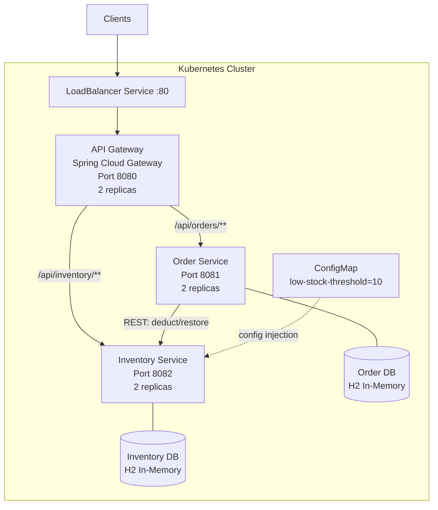

---

## Service Communication Flow

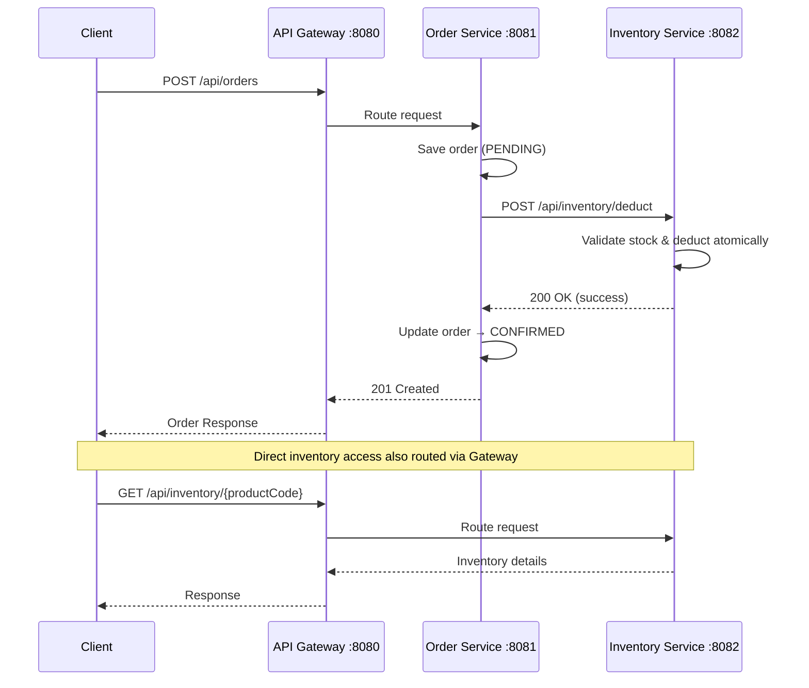

## Data Consistency Strategy

### Saga Pattern (Choreography-based)

---

### Flow 1: Order Creation — Happy Path

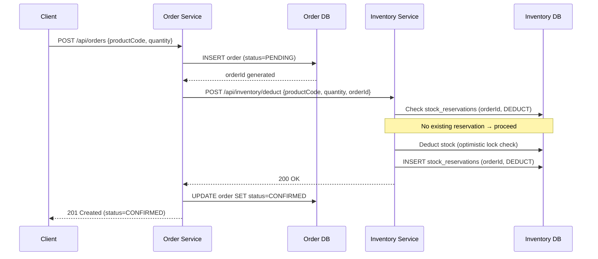

---

### Flow 2: Order Creation — Insufficient Stock (No Compensation Needed)

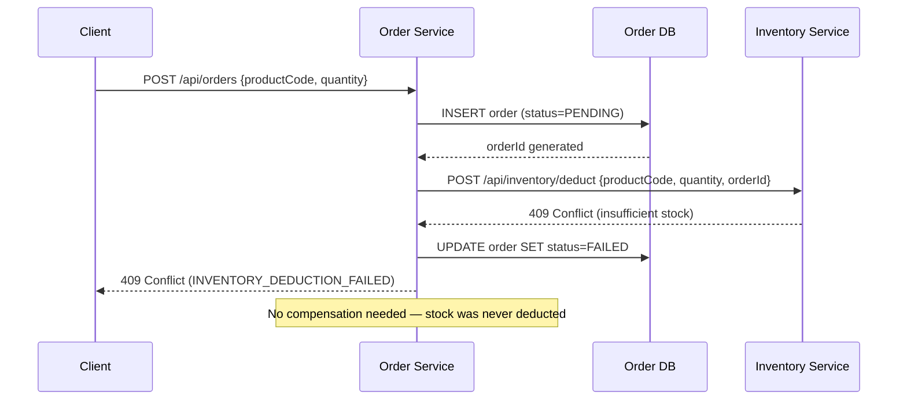

---

### Flow 3: Order Creation — Confirmation Save Fails (Compensation Triggered)

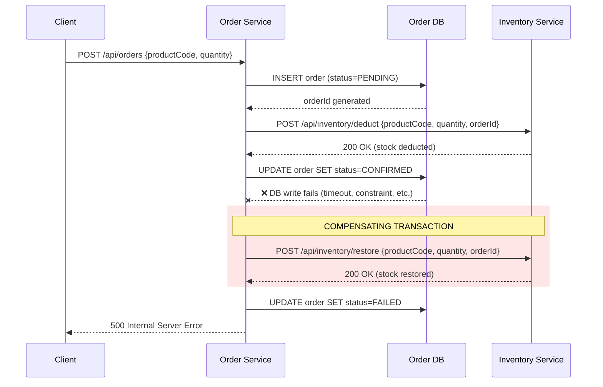

---

### Flow 4: Double Failure — Compensation Also Fails (Requires Reconciliation)

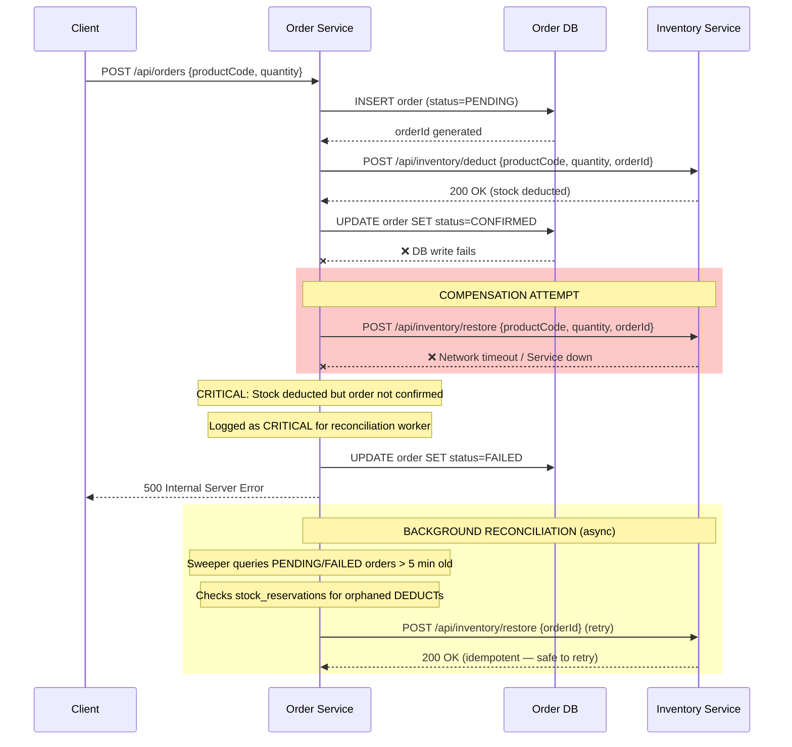

---

### Flow 5: Order Cancellation — Happy Path

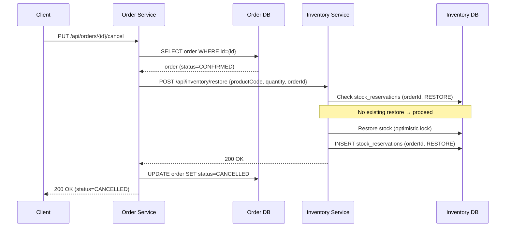

---

### Flow 6: Order Cancellation — Restore Fails (Order Stays Consistent)

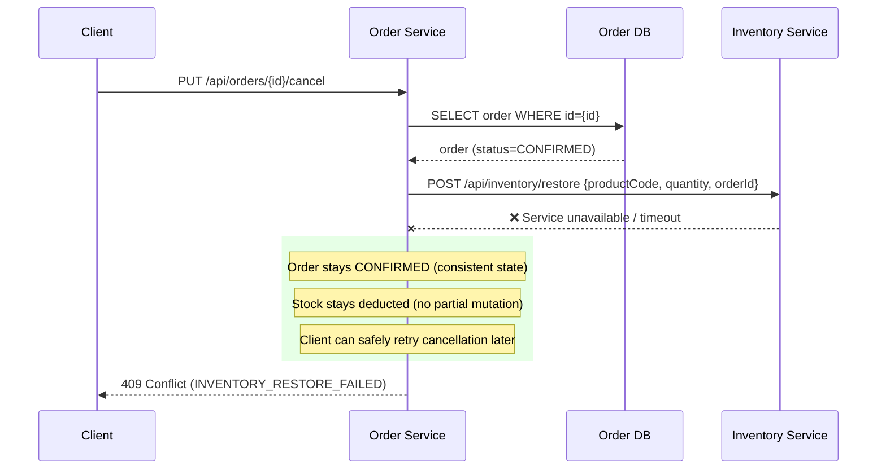

---

### Flow 7: Idempotent Retry — Duplicate Deduction Safely Skipped

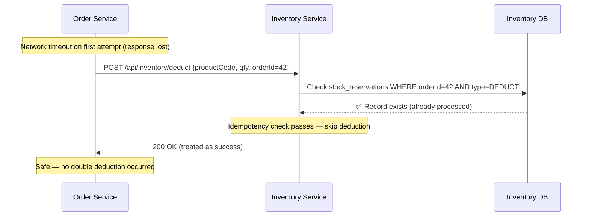

---

### Flow 8: Concurrent Deductions — Optimistic Locking

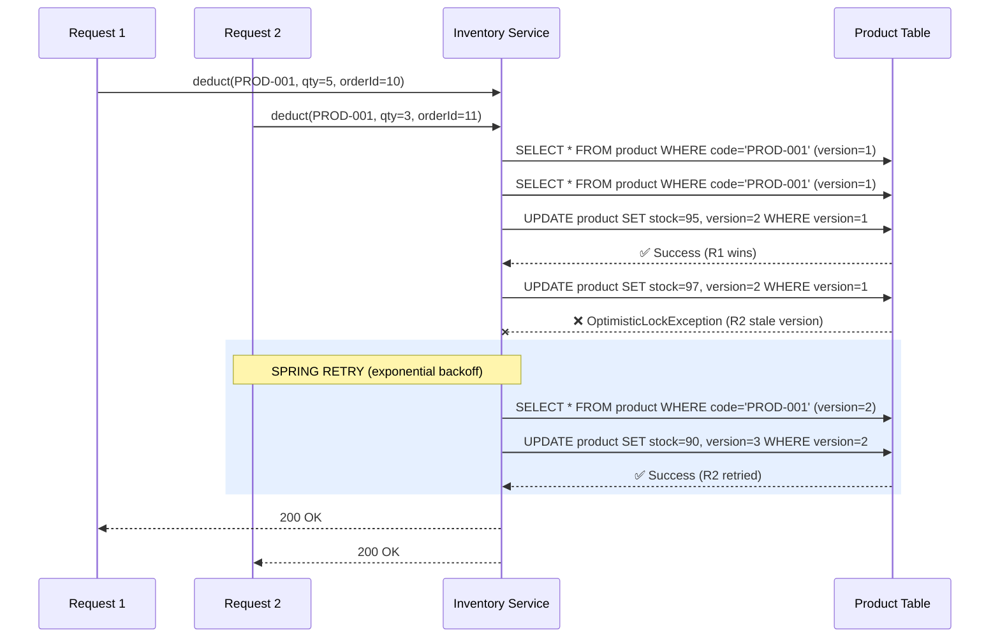

---

### Order State Machine

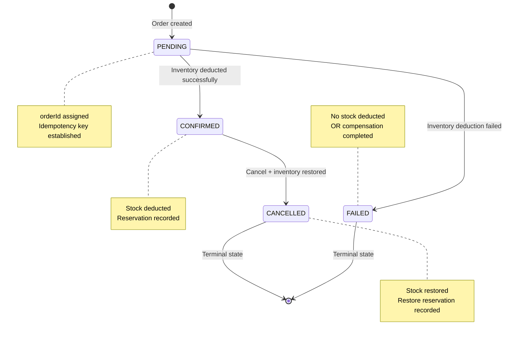

---

### Idempotency Mechanism

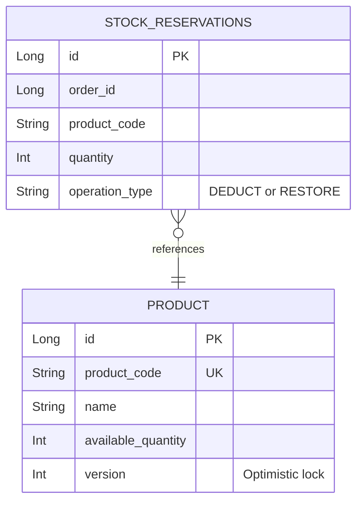

**Unique constraint:** `(order_id, operation_type)`
- Duplicate deduct/restore for the same orderId is silently skipped
- Ensures at-most-once semantics for each operation per order

---

> ### ⚠️ NOTE: Background Reconciliation Job (Not Implemented)
>
> **Scenario:** A "double failure" can leave the system in an inconsistent state:
> - Inventory stock is deducted (DEDUCT recorded in `stock_reservations`)
> - Order confirmation DB write fails
> - Compensating restore call ALSO fails (network timeout, inventory service down)
>
> **Result:** Stock is deducted but the order is stuck in `PENDING` or `FAILED` — money/stock leak.
>
> **Resolution:** A background **Saga Sweeper / Reconciliation Worker** should:
> 1. Periodically query orders in `PENDING` status older than a threshold (e.g., 5 minutes)
> 2. For each, check `stock_reservations` in Inventory Service:
>    - If `DEDUCT` exists but no `RESTORE` → stock is reserved but order not confirmed
>      - **Action:** Either confirm the order (if business allows) OR call restore with the orderId
>    - If neither `DEDUCT` nor `RESTORE` exists → no stock was taken
>      - **Action:** Mark order as `FAILED`
> 3. Same pattern applies to stuck cancellations: if order is `CONFIRMED` but a cancel was requested and restore failed, the sweeper retries the restore.
>
> **This is the standard Saga pattern resolution for distributed dual-write problems.** The idempotency keys (orderId) make all retry operations safe.

## High Concurrency Design

- **Optimistic Locking**: `@Version` on Product entity prevents concurrent overselling. Two concurrent deductions for the same product result in one success and one automatic retry (up to 3 attempts with exponential backoff).
- **Idempotency Keys**: `orderId` in `stock_reservations` prevents duplicate mutations even under network retries or at-least-once delivery.
- **Transaction Isolation**: `@Transactional` on service methods with DB-level row versioning.
- **Stateless Services**: No shared in-process state; horizontally scalable via K8s replicas.

## Kubernetes Deployment

```
k8s/
├── namespace.yaml         # presight namespace
├── configmap.yaml         # inventory.low-stock-threshold (dynamic)
├── inventory-service.yaml # Deployment (2 replicas) + ClusterIP Service
├── order-service.yaml     # Deployment (2 replicas) + ClusterIP Service
└── api-gateway.yaml       # Deployment (2 replicas) + LoadBalancer Service

Deploy order:
  kubectl apply -f k8s/namespace.yaml
  kubectl apply -f k8s/configmap.yaml
  kubectl apply -f k8s/inventory-service.yaml
  kubectl apply -f k8s/order-service.yaml
  kubectl apply -f k8s/api-gateway.yaml
```

## Running Locally

```bash
# Build all services
mvn clean package -DskipTests

# Run individually
java -jar inventory-service/target/inventory-service-1.0.0-SNAPSHOT.jar
java -jar order-service/target/order-service-1.0.0-SNAPSHOT.jar
java -jar api-gateway/target/api-gateway-1.0.0-SNAPSHOT.jar

# Or with Docker Compose
docker-compose up --build
```

## API Endpoints

### Order Service (via Gateway at :8080)
| Method | Endpoint | Description |
|--------|----------|-------------|
| POST | /api/orders | Create new order (body: `{productCode, quantity}`) |
| GET | /api/orders/{id} | Get order by ID |
| PUT | /api/orders/{id}/cancel | Cancel a confirmed order (restores inventory) |

### Inventory Service (via Gateway at :8080)
| Method | Endpoint | Description |
|--------|----------|-------------|
| GET | /api/inventory/{productCode} | Get stock info |
| POST | /api/inventory/deduct | Deduct stock (body: `{productCode, quantity, orderId}`) |
| POST | /api/inventory/restore?productCode=X&quantity=N&orderId=M | Restore stock (idempotent) |
| GET | /api/inventory/config/threshold | Get current low-stock threshold |
| PUT | /api/inventory/config/threshold?value=N | Update threshold dynamically |

### Documentation & Monitoring
| Method | Endpoint | Description |
|--------|----------|-------------|
| GET | /swagger-ui.html | Swagger UI (per service) |
| GET | /actuator/health | Health check |
| GET | /h2-console | H2 database console (dev only) |
